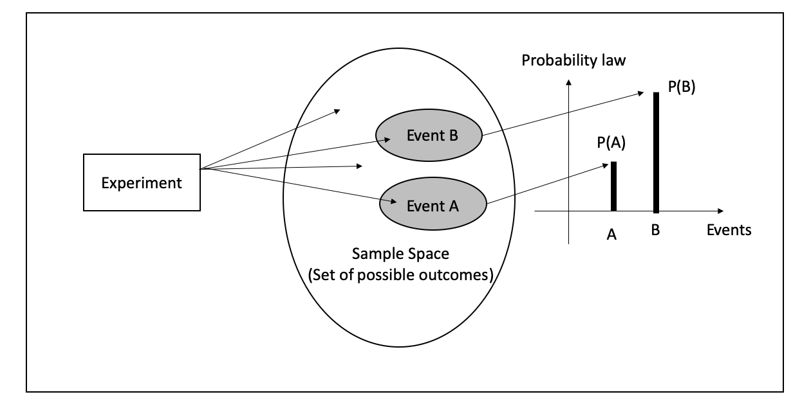

# Statistical Distributions

```{r initial1, echo = FALSE, cache = FALSE, include = FALSE}
library(knitr)
opts_chunk$set(
  warning = FALSE,
  message = FALSE,
  echo = FALSE,
  fig.path = 'figure/',
  cache.path = 'cache/',
  fig.align = 'center',
  fig.show = 'hold',
  cache = FALSE,
  external = TRUE,
  dev = "png",
  fig.height = 5,
  fig.width = 10
)


library(tidyverse)
library(ggpubr)

```

\pagenumbering{arabic}

## Recap: CM 1110-Probability {-}

### Axioms of probability {-}

```{r   out.width = "100%", echo = FALSE, fig.align='center'}

```


- **Probability** of an event quantifies the **uncertainty**, randomness, or the possibility of occurrence the event. 
- The probability of event E is usually denoted by $P(E)$.
- Mathematically, the function $P(.)$ is a set function defined from sample space $(\Omega)$ to $[0, 1]$ interval, satisfying the following properties. 
- These are called the **'axioms of probability'**.

- **Axiom 1:** For any event $A$, $P(A) \geq 0$
- **Axiom 2:** $P(\Omega) = 1$
- **Axiom 3:** 
   - (a) If $A_1, A_2, \dots, A_k$ is a finite collection of mutually exclusive events, then \[P(A_1\cup A_2\cup \dots \cup A_k)= \sum_{i=1}^kP(A_i)\]
	   (b) If $A_1, A_2, \dots$ is an infinite collection of mutually exclusive events, then 
\[P(A_1\cup A_2\cup \dots)= \sum_{i=1}^\infty P(A_i)\]

**NOTE**

- Axioms 1 and 2 imply that for any event $E$, $0 \leq P (E) \leq 1$.
- $P (E) = 1 \iff$ the event E is certain to occur.
-	$P (E) = 0 \iff$ the event E cannot occur.

### Methods for determining Probability {-}

- There are several ways for determining the probability of events. 
- Usually we use the following methods to obtain the probability of events.
    - Classical method
    - Relative frequency method (Empirical approach)
    - Subjective method
    - **Using probability models**

\newpage

## Random Variable

-	Some sample spaces contain quantitative (numerical) outcomes, others contain qualitative outcomes.
-	Often it is convenient to work with sample spaces containing numerical outcomes.
-	A function that maps the original sample space into the real numbers is called a 'random variable'.
-	This is more useful when the original sample space contains qualitative outcomes.

**Definition 1: Random Variable**

Let $\Omega$ be a sample space. Let $X$ be a function from $\Omega$  to $\Re$ (*i.e.* $X:\Omega \rightarrow \Re$). Then $X$ is called a random variable.

<!--**random variable** is a function from a sample space $S$ into the real numbers (*i.e.* $X:S \rightarrow \Re$)-->

```{r   out.width = "50%", echo = FALSE, fig.align='center'}
knitr::include_graphics("figure/Ch1_F1.png")
```

- A random variable assigns a real number to each outcome of a sample space.
-	In other words, to each outcome of an experiment or a sample point $\omega_i$, of the sample spaces, there is a unique real number $x_i$, known as the value of the random variable $X$.
- The range of the random variable is called the *induced sample space*. 
- *A note on notation:* Random variables will always denoted with uppercase letters and the realized values of the random variable (or its range) will be denoted by the corresponding lowercase letters. Thus, the random variable $X$ can take the value $x$. 
- Each outcome of a sample space occurs with a certain probability. Therefore,  each possible value of a random variable is associated with a probability. 
- Any events of a sample space can be written in terms of a suitably defined random variable. 

### Types of Random Variables

- A random variable is of two types
  - Discrete Random Variable
  - Continuous Random Variable

#### Discrete Random Variable

- If the induced sample space is discrete, then the random variable is called a **discrete random variable**.
<!--- A random variable ($X$) is said to be discrete if it takes only a finite; or an infinite but countable number of values.-->
<!-- Examples: The following are discrete random variables:
  -	Number of children per family 
  -	Attendance of CM 2110 lectures
  -	GPA credit value that you can obtain for CM 2110
  -	The number of machine breakdowns during a given day in a company
-->

*Example 01*
Consider the experiment of tossing a coin.  Express the following events using a suitably defined random variable

$H=$ *The event of getting a head*

$T=$ *The event of getting a tail*

```{r Ch1box1, out.width='100%', fig.asp=.9, fig.align='center', fig.pos='h'}
library(ggplot2)

ggplot()+
  theme_void()+
  theme(panel.border = element_rect(colour = "white", fill=NA, size=1))

```

*Example 02*

Consider the experiment of rolling of a die.  Express the following events using a suitably defined random variable

$A=$ *The event that the number faced up is less than 5*

$B=$ *The event that the number faced up is even*

$C=$ *The event that the number faced up is 2 or 5*

```{r Ch1box2, out.width='100%', fig.asp=.9, fig.align='center', fig.pos='h'}
library(ggplot2)

ggplot()+
  theme_void()+
  theme(panel.border = element_rect(colour = "white", fill=NA, size=1))

```

\newpage

*Example 03*

Consider the experiment of tossing a coin 10 times. Then the sample space $\Omega$ contains $2^{10} = 1024$ outcomes. Each outcome is a sequence of 10 H's and T's.

Express the following events in terms of a suitably defined random variable.

$D=$ *The event that the number of heads is 5*

$E=$ *The event that the number of tails is less than 4*

 
```{r Ch1box3, out.width='100%', fig.asp=.9, fig.align='center', fig.pos='h'}
library(ggplot2)

ggplot()+
  theme_void()+
  theme(panel.border = element_rect(colour = "white", fill=NA, size=1))

```

#### Continuous Random Variable

- If the induced sample space is continuous, then the random variable is called a **continuous random variable.**
<!--- A continuous random variable is a random variable that can take on any value in a given interval.
-	Random variables which consist of measurements are usually continuous. 
- For example
  -	height of a student in this class 
  -	the current measured in a thin copper wire in milliamperes
  -	Life time of a mobile phone battery
  -	SGPA of a level 2 student
-->

*Example 04*

Consider the experiment of measuring the lifetime (in hours) of a randomly selected bulb.  Express the following events in terms of a suitably defined random variable. 
 
$F=$ *The event that the lifetime is less than 300 hours*

$G=$ *The event that the lifetime is 1000 hours*

```{r Ch1box4, out.width='100%', fig.asp=.7, fig.align='center', fig.pos='h'}
library(ggplot2)

ggplot()+
  theme_void()+
  theme(panel.border = element_rect(colour = "white", fill=NA, size=1))

```


## Probability Mass Function
\label{sec:pmf}

**Definition 2: Discrete density function of a discrete random variable**

If $X$ is a discrete random variable with distinct values $x_1, x_2, \dots, x_n, \dots,$ then the function, denoted by $f_X(.)$ and defined by

\begin{equation}
f_X(x) =
\begin{cases} 
P(X=x) & \text{if } x=x_j, j=1,2,\dots,n,\dots\\
0 & \text{if } x \neq x_j
\end{cases}
\end{equation}

is defined to be the discrete density function of $X$.


<!-- - The function that gives the probability of each possible value of a discrete random variable is called its probability mass function-->


- The values of a discrete random variable are often called *mass points.*
- $f_X(x)$ denotes the *mass* associated with the *mass point* $x_j$.
- ***Probability mass function*** *discrete frequency function* and *probability function* are other terms used in place of *discrete density function*
- Probability function gives the measure of probability for different values of $X$.

### Properties of a Probability Mass Function

- Let $X$ be a discrete random variable with probability mass function $f_X(x)$. Then,

1. For any $x\in \Re$, $0\leq f_X(x) \leq 1.$
2. Let $E$ be an event and $I= \{X(\omega):\omega \in E\}.$ Then $P(E) = P(X\in I) = \sum_{x \in I}f_X(x).$
3. Let $R = \{X(\omega):\omega \in \Omega\}.$ Then $\sum_{x\in \Re} f_X(x) = 1.$


### Representations of Probability Mass Functions

*Example 05*

Consider the experiment of tossing a fair coin.  Let 

\begin{equation}
X =
\begin{cases} 
0 & \text{if the outcome is a Tail }\\
1 & \text{if the outcome is a Head}
\end{cases}
\end{equation}

Find the probability mass function of $X$. Is $X$ discrete or continuous?

#### Using a table

```{r Ch1box5, out.width='100%', fig.asp=.9, fig.align='center', fig.pos='h'}
library(ggplot2)

ggplot()+
  theme_void()+
  theme(panel.border = element_rect(colour = "white", fill=NA, size=1))

```

#### Using a function

```{r Ch1box6, out.width='100%', fig.asp=.9, fig.align='center', fig.pos='h'}
library(ggplot2)

ggplot()+
  theme_void()+
  theme(panel.border = element_rect(colour = "white", fill=NA, size=1))

```

#### Using a graph

```{r Ch1box7, out.width='100%', fig.asp=.9, fig.align='center', fig.pos='h'}
library(ggplot2)

ggplot()+
  theme_void()+
  theme(panel.border = element_rect(colour = "white", fill=NA, size=1))

```

## Probability Density Function

- Let $X$ be a continuous random variable.

- Then, it is not possible to define a pmf $f_x$ with properties mentioned in Section \ref{sec:pmf}. **Why?**

- Instead, we can find a function $f_x$ with the some different properties.

- Probability density function (pdf) of a continuous random variable is a function that describes the relative likelihood for this random variable to occur at a given point.

### Properties of a Probability Density Function
\label{sec:pdfproperties}


Let $X$ be a continuous random variable with probability density function $f_x$. Then,

1. For any $x\in \Re$, $f_X(x) \geq0$.
2. Let $E$ be an event and $I= \{X(\omega):\omega \in E\}.$ Then $P(E) = P(X\in I) = \int_If_X(x)dx.$
3. Let $R = \{X(\omega):\omega \in \Omega\}.$ Then $\int_\Re f_X(x)dx= 1.$


### Existence of pdf

- To see the existence of such a function, consider a continuous random variable $X$,
- Suppose that we have a very large number of observations, $N$, of $X$, measured to high accuracy (large number of decimal places). 
- consider the following grouped frequency table and the histogram constructed from those data. 
- The height of the bar on a class interval of this histogram is equal to the relative frequency per unit in that class interval. 


Interval | Class boundaries | Class frequency | Height of the bar | Area of the bar
---------|-----------------|-----------------|-------------------| ---------------
$I_1$| $x_1 -\delta x/2, x_1+\delta x/2$ | $n_1$ | $\frac{n_1}{\delta x*N}$ |  $\frac{n1}{N}$
$I_2$| $x_2 -\delta x/2, x_2+\delta x/2$ | $n_2$ | $\frac{n_2}{\delta x*N}$ |  $\frac{n2}{N}$
$\vdots$| $\vdots$ |$\vdots$| $\vdots$| $\vdots$
$I_k$| $x_k -\delta x/2, x_k+\delta x/2$ | $n_k$ | $\frac{n_k}{\delta x*N}$ |  $\frac{nk}{N}$ 
  | Total|  |  | 


```{r hist, fig.cap="Histograms with different class intervals and a possible model for the pdf", fig.height=15, fig.width=25}
set.seed(123)
data <- data.frame(x= c(rnorm(10000,45,10), rnorm(20000,90,10))) 


p1 <- data %>%
  ggplot(aes(x, ..density..)) +
  geom_histogram(bins= 10)+
  geom_density(colour= "red", size= 2)+
  ggtitle("(a)") +
  ylab("Probability density")

p2 <- data %>%
  ggplot(aes(x, ..density..)) +
  geom_histogram(bins= 20)+
  geom_density(colour= "red",  size= 2)+
  ggtitle("(a)") +
  ylab("Probability density")

p3 <- data %>%
  ggplot(aes(x, ..density..)) +
  geom_histogram(bins=40)+
  geom_density(colour= "red",  size= 2)+
  ggtitle("(a)") +
  ylab("Probability density")

p4 <- data %>%
  ggplot(aes(x, ..density..)) +
  geom_histogram(bins= 100)+
  geom_density(colour= "red", size = 2)+
  ggtitle("(a)") +
  ylab("Probability density")

p<- ggarrange(ggarrange(p1,p2,ncol = 2) , ggarrange(p3,p4, ncol = 2), nrow= 2)
print(p)
```

- Then, for the $i^{th}$ interval, 

$$P(x_i - \frac{\delta x}{2} \leq X \leq x_i + \frac{\delta x}{2}) \approx \text{Area of the bar} $$
 and therefore
 
$$\text{Height of the bar} \approx \frac{\text{Area of the bar}}{\delta x} \approx \frac{ P(x_i - \frac{\delta x}{2} \leq X \leq x_i + \frac{\delta x}{2})}{\delta x}  $$

- Therefore, the height of a bar represents the *probability density* in that class interval.

- When $\delta x \rightarrow0$, it will allow us to approximate the histogram by a smooth curve as in Figure \ref{fig:hist} (d). 

- As the area under each histogram is 1, the area under the curve is also 1

- For any point $x$, 

$$\text{The height of the curve} \approx \lim \limits_{\delta x \to 0} \frac{P(x_i-\frac{\delta x}{2} \leq X \leq x_i+\frac{\delta x}{2})}{\delta x} $$

will represent the **the probability density at point** $x$. 

- Let the above smooth curve be denoted  by $f_X$.
- Then, $f_X$ has the properties mentioned in Section \ref{sec:pdfproperties}.
- The function is called the **probability density function of**
$X$.

- **NOTE** Here $f_X(x)$ represents **Probability density** *at point* $x$. Not *Probability at point* $x$.


<!--The shape of the density function $f_x$ of a continuous random variable $X$ is approximately the same as the smoothed histogram from a very large data set $X$-->


### Calculation of Probability using pdf

- Let $c,d \in \Re$ such that $c\leq d$. Then,

$$P(c\leq X \leq d) = \int_c^d f_X(x)dx$$

```{r hist2, fig.cap="$P(c\\leq x \\leq d = \\int_c^d f_X(x)dx$"}
set.seed(123)
data <- data.frame(x= c(rnorm(10000,45,10), rnorm(20000,90,10))) 

dat <- with(density(data$x), data.frame(x, y))
p<- ggplot(data = dat, mapping = aes(x = x, y = y)) +
    geom_line()+
    geom_area(mapping = aes(x = ifelse(x>50 & x< 80 , x, 0)), fill = "darkblue") +
    xlim(2, 128)+
  ylab("f(x)")

print(p)
```


- **NOTE:** if $X$ is a continuous random variable with the p.d.f $f_X$, then for any $k \in \Re$,

$$P(X=k) = P(k\leq X\leq k)=\int_k^kf_X(x)dx = 0$$

- Therefore, for a continuous random variable $X$, 
$$P(c<X<d) = P(c\leq X<d) =  P(c < X\leq d)=  P(c \leq X\leq d)= \int_c^df_X(x)dx$$


## Cumulative Distribution Function

- There are many problems in which it is of interest to know the probability that the values of a random variable is less than or equal to some real number $x$.

**Definition 3: Cumulative distribution function**

The *cumulative distibution function* or $cdf$ of a random variable $X$, denoted by $F_X(x)$, is defined by 

$$F_x(x) = P(X\leq x), \text{ for all } x $$

- Therefore, if $X$ is a discrete random variable, the cdf is given by,

$$F_X(x)=\sum_{t\leq x}f_X(t), \text{ } -\infty < x<\infty$$

where $f_X(t)$ is the value of the pmf of $X$ at $t$.


### Relationship between cdf and pdf 

- If $X$ is a continuous random variable, the cdf is given by, 

$$F_X(x) = \int_{-\infty}^{x}f_X(t)dt \text{  } -\infty <x<\infty$$
where $f_X(t)$ is the value of the pdf of $X$ at $t$. (Here $t$ is a dummy integration variable).

- Conversely,

$$f_X(x)= \frac{dF_X(x)}{dx}$$

*Example 06*

An owner of a  software engineering company is interested in knowing how many years his employees stay with his company. Let $X$ be the number of years an employee will stay with the company. Over the years, he has established the following probability distribution:

\newpage

$x$	|1|	2|	3|	4|	5|	6|	7
--|---|---|---|---|---|---|---
 $f_X(x) = P(X=x)$|0.1	|0.05|	0.1|?|0.3|	0.2|	0.1

1. Find $f_X(4)$

```{r Ch1box8, out.width='100%', fig.asp=.5, fig.align='center', fig.pos='h'}
library(ggplot2)

ggplot()+
  theme_void()+
  theme(panel.border = element_rect(colour = "white", fill=NA, size=1))

```

2. Find $P(X<4)$

```{r Ch1box9, out.width='100%', fig.asp=.7, fig.align='center', fig.pos='h'}
library(ggplot2)

ggplot()+
  theme_void()+
  theme(panel.border = element_rect(colour = "white", fill=NA, size=1))

```

3. Find $P(X\leq4)$

```{r Ch1box10, out.width='100%', fig.asp=.7, fig.align='center', fig.pos='h'}
library(ggplot2)

ggplot()+
  theme_void()+
  theme(panel.border = element_rect(colour = "white", fill=NA, size=1))

```

4. Draw the probability mass function of $X$

```{r Ch1box11, out.width='100%', fig.asp=.7, fig.align='center', fig.pos='h'}
library(ggplot2)

ggplot()+
  theme_void()+
  theme(panel.border = element_rect(colour = "white", fill=NA, size=1))

```


5. Draw the cumulative distribution function of $X$

```{r Ch1box12, out.width='100%', fig.asp=.7, fig.align='center', fig.pos='h'}
library(ggplot2)

ggplot()+
  theme_void()+
  theme(panel.border = element_rect(colour = "white", fill=NA, size=1))

```

```{r Ch1box13, out.width='100%', fig.asp=.7, fig.align='center', fig.pos='h'}
library(ggplot2)

ggplot()+
  theme_void()+
  theme(panel.border = element_rect(colour = "white", fill=NA, size=1))

```

### Properties of a cumulative distribution function of a Discrete random variable


*Example 07*

\begin{equation}
f_X(x) =
\begin{cases} 
\frac{1}{25}x & 0\leq x < 5\\
\frac{2}{5}- \frac{1}{25}x & 5\leq x \leq 10\\
0 & \text{otherwise}
\end{cases}
\end{equation}

1. Find the CDF of $X$
2. Find $P(X\leq 8)$
3. Find $P(3\leq X\leq 8)$


\newpage
1. 

\newpage


## Expectations and Moments

<!-- Casella pg 55-->

### Expectation

- The expected value, or expectation of a random variable is merely its average value. 

- By weighting the values of the random variable according to the probability distribution, we can obtain a number that summarizes a typical or expected value of an observation of the random variable.

**Definition 4: Expected value**

Let $X$ be a random variable. The *expected value* or *mean* of a random variable $g(X)$, denoted by $E[g(x)],$ is

\begin{equation}
E[g(x)] =
\begin{cases} 
\sum_{x}g(x) f_X(x) & \text{if } X \text{ is a discrete random variable with pmf }  f_X(x) \\
\int_x g(x) f_X(x)dx & \text{if } X \text{ is a continuous random variable with pdf }  f_X(x)
\end{cases}
\end{equation}

<!--Casella pg 57-->

- The mean of a random variable gives a measure of *central location* of the density of $X$.

- The process of taking expectations is a linear operation.

- For any constants $a$ and $b$, 
$$E(aX+b) = aE(X)+b$$

#### Properties of expected value
<!-- mood pg 70-, casella pg 57-->

**Theorem**

a. $E(c) = c$ for a constant $c$
b. $E[cg(X)] = cE[g(X)]$ for a constant $c$
c. $E[c_1g_1(X)+c_2g_2(X)]= c_1E[g_1(X)]+c_2E[g_2(X)]$
d. If $g_1(x) \geq 0$ for all $x$, then $E[g_1(X)] \geq 0$
e. If $g_1(x) \geq g_2(x)$ for all $x$, then $E[g_1(X)] \geq E[g_2(X)]$
f. If $a\leq g_1(x) \leq b$ for all $x$, then $a\leq E[g_1(X)] \leq b$
g. If $X$ and $Y$ are two **independent** random variables, then $E(X \times Y) = E(X)\times E(Y)$


*Example 08*

Random variable $X$ has the following pmf

\begin{equation}
f_X(x) =
\begin{cases} 
0.2 &  x =2\\
0.3 &  x =4\\
0.4 &  x =5\\
0.1 &  x =7
\end{cases}
\end{equation}

1. Find $E(X)$
2. Find $E(X^2)$
3. Find $E\left( \frac{1}{X}\right)$
4. Find $E(2X+3X^2-5)$

```{r Ch1box15, out.width='100%', fig.asp=.9, fig.align='center', fig.pos='h'}
library(ggplot2)

ggplot()+
  theme_void()+
  theme(panel.border = element_rect(colour = "white", fill=NA, size=1))

```

\newpage 

### Moments

- The various moments of a distribution are an important class of expectation

<!-- Mood pg 73-->

**Definition 5: Moments**

If $X$ is a random variable, the $r$*th moment of* $X$, usually denoted by $\mu_r^\prime,$ is defined as

$$\mu_r^\prime = E(X^r).$$

if the expectation exists.

- Note that $\mu_1^\prime = E(X)= \mu,$ the mean of $X$.


**Definition 6: Central moments**


If $X$ is a random variable, the $r$*th central moment of* $X$ *about* $a$ is defined as $E[(x-a)^r]$.


If $a= E(X) = \mu,$ we have the $r$*th central moment of* $X$, *about* $E(X)$, denoted by $\mu_r,$ which is 
$$\mu_r=E[(X-E(X))^r] = E[(X-\mu)^r] .$$

- Find $\mu_1$

\newpage 

**Definition 7: Variance**
<!-- Casella pg 59-, mood 70-->

If $X$ is a random variable, $Var(X)= E[(X-E(X))^2]= E(X^2) - [E(X)]^2$ provided $E(X^2)$ exists.

```{r Ch1box16, out.width='100%', fig.asp=.9, fig.align='center', fig.pos='h'}
library(ggplot2)

ggplot()+
  theme_void()+
  theme(panel.border = element_rect(colour = "white", fill=NA, size=1))

```

- The *variance* of a random variable $X$ is its second central moment, $Var(X) = E[(X-E(X))^2]= E[(X-\mu)^2]$

- The positive square root of $Var(X)$ is the *standard deviation* of $X$

<!-- mood 67-->

- The *variance* of a random variable gives a measure of the degree of spread of a distribution around its mean. 

- Let $X$ be a random variable, and let $\mu$ be $E(X).$ the *variance* of $X$, denoted by $\sigma^2$ of $Var(X),$ is defined by


\begin{equation}
Var(X) =
\begin{cases} 
\sum_{x}(x-\mu)^2f_X(x) & \text{if } X \text{ is  discrete with mass points }  x_!, x_2, \dots, x_j\dots \\
\int_x (x-\mu)^2 f_X(x)dx & \text{if } X \text{ is continuous with probability density function }  f_X(x)
\end{cases}
\end{equation}

#### Properties of variance of a random variable
<!-- mood pg 70-, casella pg 57-->

**Theorem**

a. If $c$ is a constant, then $V(cX) = c^2V(X)$ 
b. $V(c) = 0$, Variance of a constant is zero. 
c. If $X$ is a random variable and $c$ is a constant, then $V(c+X) = V(X)$
d. If $a$ and $b$ are constants, then $V(aX+b)= a^2V(X)$
e. If $X$ and $Y$ are two independent random variables, then
   i. $V(X+Y) = V(X) + V(Y)$
   ii. $V(X-Y) = V(X) + V(Y)$


```{r Ch1box14, out.width='100%', fig.asp=.9, fig.align='center', fig.pos='h'}
library(ggplot2)

ggplot()+
  theme_void()+
  theme(panel.border = element_rect(colour = "white", fill=NA, size=1))

```


\newpage

## Models for Discrete Distributions

### Discrete Uniform Distribution
<!--Casella page 86-->
A random variable $X$ has a *discrete uniform* $(1, N)$ distribution if 
$$f_X(x)= P(X=x)=\frac{1}{N}, \;\; x=1,2,\dots, N$$
where $N$ is a specified integer.

- The distribution puts equal mass on each of the outcomes $1,2,\dots, N.$

- If $X$ ha s a discrete uniform distribution, then $E(X) = (N+1)/2$ and $Var(X) = (N^2-1)/12.$

### Bernoulli Distribution

**Bernoulli Trial**

A random experiment of which the outcome can be classified into two categories is called a *Bernoulli trial*

- In general, the results of a Bernoulli Trial are called 'success' and 'failure'. We denote these results by $S$ and $F$, respectively.

- Consider a Bernoulli trial. Let 

\begin{equation}
X=
\begin{cases} 
0 & \text{if the Bernoulli trial results in a failure } \\
1 & \text{if the Bernoulli trial results in a success} 
\end{cases}
\end{equation}

- Suppose that the probability of a ''success' in any Bernoulli trial is $\theta.$

- Then $X$ is said to have a Bernoulli distribution with probability mass function

$f_X(x)= P(X=x)=\theta^x(1-\theta)^{1-x}, \;\;x=0,1$

- This is denoted as $X \sim Bernoulli(\theta).$

- If $X$ has a Bernoulli distribution, then  $E(X) = \theta$ and $Var(X) = \theta(1-\theta)$

### Binomial Distribution

<!--Mood page 89-->
- A random experiment with the following properties is called a 'Binomial experiment'

1. The random experiment consists of  a sequence of $n$ trials, where $n$ is fixed in advance of the random experiment.

2. Each trial can result in one of the same two possible outcomes: "success" $(S)$ or "failure" $(F)$

3. The trials are independent. Therefore the outcome of any particular trial does not influence the outcome of any other trial.

4. The probability of "success" is the same for each trial. Let this probability is $\theta.$

**Binomial distribution**

- Consider a binomial experiment with $n$ trials and probability $\theta$ of a success.

A random variable $X$ is defined to have a *binomial distribution* if the discrete density function of $X$ is given by 
$$f_X(x)= P(X=x)= {n\choose x}\theta ^x(1-\theta)^{n-x} , \;\; x=0,1,2,\dots, n$$

- This is denoted as $X \sim Bin(n,\theta).$

- If $X$ has a binomial distribution, then  $E(X) = n\theta$ and $Var(X) = n\theta(1-\theta)$

- The binomial distribution reduces to the Bernoulli distribution when $n=1.$

### Geometric Distribution

- Consider a sequence of independent Bernoulli trials whose  probability of "success" for each trial is $\theta$.

- Let $X= \text{Number of failures before the first success}$

- Then, $X$ is said to have a Geometric distribution with parameter $\theta.$

- The probability mass function is given by 
$$f_X(x)= P(X=x)= \theta (1-\theta)^x , \;\; x=0,1,2,\dots$$

- This is denoted as $X \sim Geometric(\theta).$

- If $X$ has a geometric distribution, then  $E(X) = (1-\theta)/\theta$ and $Var(X) = (1-\theta)/\theta^2$
<!-- Mood page 101-->

- A random variable $X$ that has a geometric distribution is often referred to as a discrete *waiting-time* random variable. It represents how long (in terms of number of failures) one has to wait for a "success."

### Negative Binomial Distribution

- Consider a sequence of independent Bernoulli trials whose  probability of "success" for each trial is $\theta$.

- Let $X= \text{Number of failures before the rth success}$

- Then, $X$ is said to have a Negative Binomial distribution with parameter $\theta.$

- The probability mass function is given by 
$$f_X(x)= P(X=x)= {x+r-1\choose r-1} \theta^r (1-\theta)^x , \;\; x=0,1,2,\dots$$

- This is denoted as $X \sim negbin(r,\theta).$

- If $X$ has a Negative Binomial distribution, then  $E(X) = r(1-\theta)/\theta$ and $Var(X) = r(1-\theta)/\theta^2$

- If in the negative binomial distribution $r=1$, then the negative binomial density specializes to the geometric density. <!-- mood page 99-->

### Hypergeometric Distribution

- Suppose a population of size $N$ has $M$ individuals of a certain kind ("success").

- A sample of $n$ items is taken from this population without replacement.

- Let $X$ be the number of successes in the sample. 

- Then, $X$ is said to have a hypergeometric distribution.

- The probability mass function is given by 
$$f_X(x)= P(X=x)= \frac{{M\choose x}{N-M\choose n-x}}{{N \choose n}}  , \;\; x=0,1,2,\dots, n$$

- Hypergeometric distribution can be used as a model for the number of "successes" in a sample of size $n$ if the sampling is done without replacement from a relatively small population. 

- If $X$ has a Hypergeometric  distribution, then  $E(X) = n.\frac{M}{N}$ and $Var(X) = n\frac{M}{N}\left(1-\frac{M}{N}\right)\left(\frac{N-n}{N-1}\right)$


### Poisson Distribution

- The Poisson distribution provides a realistic probability model for the number of events in a given period of time, space, region or length. 

- Example:
    - The number of fatal traffic accidents per week in a given city
    - The number of emails per hour coming into the company of a large business
    - the number of defect per unit of some material
    
- Poisson distribution is suitable if the following conditions hold.
   1. the number of events within non-overlapping time intervals are independent.
   2. Let $t$ be a fixed time point. For a small time interval $\delta t$, the probability of exactly one event happening in the interval $[t,t+\delta t]$ is approximately proportional to the length $\delta t$ of the interval. *i.e.,*  
   
$$\frac{P(\text{exactly one event in }[t,t+\delta t])}{\delta t} \to \text{a positive constant}$$
as $\delta t \to 0.$
   
   
  3. Let $t$ be a fixed time point. For a small time interval $\delta t$, the probability of more than one event happening in the interval $[t,t+\delta t]$ is negligible. *i.e.,*  
   
$$\frac{P(\text{more than one event in }[t,t+\delta t])}{\delta t} \to 0$$
as $\delta t \to 0.$
   
   
- Let $X$ be the number of events during a time interval.
- Suppose that the average number of events during the interested time interval is $\lambda (>0).$
- Then, the distribution of $X$ can be modeled by a Poisson Distribution with the probability mass function,

$$f_X(x)= P(X=x)= \frac{e^{-\lambda} (\lambda)^x}{x!}  , \;\; x=0,1,2,\dots$$
- This is denoted as $X \sim Poisson(\lambda).$
 
- If $X$ has a Poisson distribution, then  $E(X) = \lambda$ and $Var(X) = \lambda$

- The Poisson distribution can be used for counts of some sort of a given area, space, region, volume or length as well.

*Example 09*

Phone calls arrive at a switchboard at an average rate of 2.0 calls per minute.

If the number of calls in any time interval follows the Poisson distribution, then

$X =$ number of phone calls in a given minute.
$X \sim  Poisson(\; )$      

$Y =$ number of phone calls in a given hour.
$Y \sim  Poisson ( \;)$

$W =$ number of phone calls in a 15 seconds.
$W \sim  Poisson (\;)$


\newpage
## Models for Continuous Distributions

### Uniform Distribution

- The continuous uniform distribution is defined by spreading mass uniformly over an interval $[a,b]$.

-	A random variable $X$ is said to have a  uniform distribution in $(a,b)$ if its probability density function is given by
$$f_X(x) = \frac{1}{b-a};\; a\leq x\leq b$$

- This is denoted as $X\sim U(a,b)$   or    $X \sim Unif(a, b)$

- It is easy to check $\int_a^bf(x) dx =1$.

- We also have 
$$E(X) = \int_a^b\frac{x}{b-a}dx = \frac{a+b}{2}$$

$$Var(X) =  \frac{(b-a)^2}{12}$$


```{r unif, fig.cap="Uniform probabiity density", fig.height = 3, fig.width = 4}
set.seed(123)
data <- data.frame(x=c(runif(10000,10,100)))

p1 <- data %>%
  ggplot(aes(x, ..density..)) +
  geom_histogram(bins= 20)

print(p1)
```

### Normal Distribution (Gaussian Distribution)

- One commonly used bell shaped curve is called the normal distribution. 

- Many techniques use din applied statistics are based upon the normal distribution.

- The normal distribution has two parameters, usually denoted by $\mu$ and $\sigma^2$, which are its mean and variance.

- A random variable $X$ is said to have a normal distribution with location parameter $\mu$  and scale parameter $\sigma$, if its probability density function is given by,

$$f_X(x)=f_X(x;\mu, \sigma)= \frac{1}{\sqrt{2\pi}\sigma}e^{-\frac{1}{2}\left(\frac{x-\mu}{\sigma}\right)^2};\;\; -\infty<x<\infty$$

- This is denoted by $X \sim N(\mu, \sigma^2)$.

- The normal density function is **symmetric around** the location parameter $\mu$.

- The **dispersion of the distribution** depends on the scale parameter  $\sigma$. 

- If $X$ is a normal random variable, $E(X) = \mu$ and $Vax(X) = \sigma^2$

```{r norm, fig.cap="Normal distribution for different $\\mu$ and $\\sigma$", fig.height=15, fig.width=25}
set.seed(123)
data <- data.frame(x1= c(rnorm(1000000,2,0.3)), x2= c(rnorm(1000000,0,0.2)), x3= c(rnorm(1000000,0,0.5)), x4= c(rnorm(1000000,0,1))) 


p1 <- data %>%
  ggplot(aes(x1, ..density..)) +
  geom_density(colour= "red", size= 1)+
  ylab("Probability density")

p2<- p1+ 
  geom_density(data = data, aes(x2, ..density..), colour= "blue", size= 1)

p3<- p2+ 
  geom_density(data = data, aes(x3, ..density..), colour= "green", size= 1)

p4<- p3+ 
  geom_density(data = data, aes(x4, ..density..), colour= "purple", size= 1)+
  geom_vline(xintercept=0)
  

print(p4)
```

```{r norm2, fig.cap="$P(a< X < b = \\int_a^b f_X(x)dx$"}
set.seed(123)
data <- data.frame(x= c(rnorm(1000000,45,10)) )

dat <- with(density(data$x), data.frame(x, y))
p<- ggplot(data = dat, mapping = aes(x = x, y = y)) +
    geom_line()+
    geom_area(mapping = aes(x = ifelse(x>50 & x< 60 , x, 0)), fill = "darkblue") +
    xlim(2, 90)+
  ylab("f(x)")

print(p)
```

$$P(a<X<b)=\int_a^b \frac{1}{\sqrt{2\pi}\sigma}e^{-\frac{1}{2}\left(\frac{x-\mu}{\sigma}\right)^2}dx$$

-	Evaluating of this integration is somewhat tedious
- 	When we calculate this type of probabilities of normal distribution manually, it is convenient to use a normal probability table.


#### Standard Normal Distribution 

-	Normal distribution with $\mu =0$ and  $\sigma = 1$  is called the **standard normal distribution**.
- A random variable with standard normal distribution is usually denoted by $Z$.
- The probability density function of standard normal distribution is denoted by $\phi$ 
-	If $Z\sim N(0,1)$, then

$$\phi_Z(z) = \frac{1}{\sqrt{2 \pi}}e^{-\frac{1}{2}z^2};\;\; -\infty< z< \infty$$

 
- Probabilities related to Z can be found by using standard normal probability table.

\newpage 

*Example 10*

Let $Z$ be a standard normal random variable. Calculate probabilities given in table below. 

No. |Calculate this probability | Answer
----|---------------------------|---------
1   | 	$P(Z < 0)$              | 
2	  |   $P(Z < 2.02)$           |
3   | 	$P(Z > 0.95)$           | 
4	  |   $P(Z > -1.48)$          | 
5	  |   $P(Z < -1.76)$          | 
6	  |   $P(Z < 1.7)$            | 
7	  |   $P(Z < -0.33)$          | 
8   |	  $P(0.94 < Z < 2.41)$    | 
9	  |   $P(-2.41 < Z < -0.94)$  |
10	|   $P(-2.96 < Z < 1.05)$   |


\newpage
Example contd...


\newpage
**Cumulative Standard Normal Distribution**

```{r   out.width = "100%", echo = FALSE, fig.align='center'}
knitr::include_graphics("figure/ztable.png")
```

\newpage

$Z_\alpha$ **Notation**

- $Z_\alpha$  denotes the value such that  $P(Z\geq Z_\alpha) = \alpha$
- Here $\alpha$ represents a probability.
- Therfore $0\leq \alpha \leq 1$

*Example 11* 

Find $Z_{0.025}$''

```{r norm3, fig.cap="$P(a< X < b = \\int_a^b f_X(x)dx$"}
set.seed(123)
data <- data.frame(x= c(rnorm(10000000,0,1)) )

dat <- with(density(data$x), data.frame(x, y))
p<- ggplot(data = dat, mapping = aes(x = x, y = y)) +
    geom_line()+
    geom_area(mapping = aes(x = ifelse(x>1.96 & x< 5 , x, 0)), fill = "darkblue") +
    xlim(-4, 4)+
   ylim(0, 0.43)+
  ylab("f(x)") + 
  xlab("z")

print(p)
```

*Example 12* 

Find the following values

   1) $Z_{0.01}$
   2) $Z_{0.05}$
   3) $Z_{0.9}$
   4) $Z_{0.975}$
   5) $Z_{0.85}$

 
\newpage
Example contd ...
 


\newpage 
#### Calculation of Probabilities of Normal Distribution

- Suppose $X \sim N(\mu, \sigma^2)$. 
- Let $Z = \frac{x-\mu}{\sigma}$. 
- Then, $Z \sim N(0,1)$
- This result can be used to find probabilities of any normal distribution.

*Example 13*

Let $X \sim N(10,4).$ Calculate $P(X \geq 15)$

```{r Ch1box17, out.width='100%', fig.asp=.6, fig.align='center', fig.pos='h'}
library(ggplot2)

ggplot()+
  theme_void()+
  theme(panel.border = element_rect(colour = "white", fill=NA, size=1))

```

*Example 14*

Calculate the probabilities in the table below

No. | $\mu$  | $\sigma$  | Calculate this probability | Answer  
----|--------|-----------|--------------------------|-------
1 | 95| 16| $P(104.92 \leq X \leq 115.16)$  |
2 | 65| 15| $P(X \leq 86.66)$  |
3 | 96| 20| $P( X < 86.3)$  |
4 | 93| 8| $P(91.24 \leq X \leq 109.34)$  |
5 | 63| 9| $P(65.55 < X < 76.61)$  |
6 | 102| 8| $P( X > 80.55)$  |
7 | 79| 18| $P(X < 131.15)$  |
8 | 86| 6| $P( X \leq 69.2)$  |
9 | 85| 2| $P(X < 86.46)$  |
10 | 100| 5| $P(X \leq 112.26)$  |
11 | 58| 10| $P(75.19 \leq X \leq 82.1)$  | 0.0348
12 | 49| 7| $P(X \geq 48.52)$  | 0.5273
13 | 103| 17| $P(73.97 \leq X \leq 138.28)$  | 0.9371
14 | 99| 24| $P( X < 82.8)$  | 0.2498
15 | 52| 10| $P( X \leq 53.58)$  | 0.5628
16 | 72| 8| $P(70.45 < X \leq 93.5)$  | 0.5732
17 | 82| 20| $P(48.14 < X  < 99.49)$  | 0.7639
18 | 94| 15| $P(91.93 \leq X \leq 98.55)$  | 0.1741
19 | 45| 4| $P(42.36 \leq X \leq 50.59)$  | 0.6643
20 | 73| 1| $P(X \geq 72.38)$  | 0.7324


*Example 15*

Calculate the quantiles $k$ in the table below

No. | $\mu$  | $\sigma$  | Calculate $k$ such that | Answer  
----|--------|-----------|--------------------------|-------
1 | 85| 6| $P( X <k)= 0.9936$  | 
2 | 97| 23| $P( X <k)= 0.0694$  | 
3 | 77| 5| $P( X >k)= 0.0002$  | 
4 | 93| 12| $P( X >k)= 0.0023$  | 
5 | 67| 3| $P( X <k)= 0.0197$  | 
6 | 59| 5| $P( X >k)= 0.9756$  | 
7 | 94| 13| $P( X >k)= 0.3228$  | 
8 | 51| 4| $P( X <k)= 0.1515$  | 
9 | 49| 10| $P( X >k)= 0.9693$  | 
10 | 61| 13| $P( X <k)= 0.9946$  | 
11 | 69| 14| $P( X <k)= 0.9357$  | 
12 | 85| 5| $P( X>k)= 0.008$  | 
13 | 96| 16| $P( X >k)= 0.0014$  | 
14 | 96| 7| $P( X <k)= 0.2578$  | 
15 | 45| 4| $P( X <k)= 0.2578$  | 


#### Empirical Rule for Normal Distribution


```{r norm4, fig.cap="Empirical Rule for Normal Distribution"}
set.seed(123)
data <- data.frame(x= c(rnorm(10000000,0,1)) )

dat <- with(density(data$x), data.frame(x, y))
p<- ggplot(data = dat, mapping = aes(x = x, y = y)) +
    geom_line()+
    #geom_area(mapping = aes(x = ifelse(x>1.96 & x< 5 , x, 0)), fill = "darkblue") +
    geom_area( fill = "gray") +
    xlim(-4, 4)+
   ylim(0, 0.43)+
  ylab("") + 
  xlab("") +
  geom_vline(xintercept=c(0,-1,1,-2,-2,-3,3)) + 
  theme(axis.text = element_blank() )

print(p)
```

Calculate the following probabilities
1. $P(|x-\mu|\leq \sigma)$
2. $P(|x-\mu|\leq 2\sigma)$
3. $P(|x-\mu|\leq 3\sigma)$

**Empirical Rule for Normal Distribution**

Approximately 68% of the values in any normal distribution lie within one standard deviation, approximately 95% lie within two standard deviations and approximately 99.7% lie within three standard deviations from the mean. 

-  The  normal distribution is somewhat special as its two parameters $\mu$ (the mean) and $\sigma^2$ (the variance), provide us with complete information about the exact shape and location of the distribution. 

- Straightforward calculus shows that the normal distribution has its maximum at $x=\mu$ and inflection point (where the curve changes from concave to convex) at $\mu \pm\sigma.$

### Gamma Distribution

- We come across with many practical situations in which the variable of interest has a skewed distribution.

- The gamma family of distributions is a flexible family of distributions on $[0,\infty)$ that yields a wide variety of skewed distributions

<!--casella-->

A random variable $X$ is said to have a gamma distribution with shape parameter $\alpha$ and scale parameter $\beta$ if its probability density function is given by 

$$f_X(x;\alpha, \beta)= \frac{1}{\Gamma(\alpha)\beta ^ {\alpha}}x^{\alpha-1}e^{-x/\beta}, \;\; 0<x<\infty,\;\; \alpha >0, \;\;\beta >0$$

Here  $\Gamma(\alpha)$ is called the  *gamma function*, 

$$\Gamma(\alpha)=\int_0^{\infty}x^{\alpha-1}e^{-x}dx$$
- The gamma function satisfies many useful relationships, in particular,

  1. $\Gamma(\alpha+1)=\alpha\Gamma(\alpha),\;\; \alpha >0$  (can be verified through integration by parts)
  2. $\Gamma(1) =1$
  3. For any positive integer $n(>0)$, $\Gamma(n)=(n-1)!$
  4. $\Gamma \left (\frac{1}{2} \right) = \sqrt{\pi}$
     
- When $X$ has a gamma distribution with shape parameter $\alpha$ and scale parameter $\beta$, it is denoted as $X \sim gamma(\alpha, \beta)$

- The parameter $\alpha$ is known as the shape parameter, since it most influences the peakedness of the distibution

- The parameter $\beta$ is called the scale parameter, since most of its influence is on the spread of the distribution.

```{r gamma, fig.cap="Gamma density functions"}
set.seed(123)
data1 <- data.frame(x= c(rgamma (10000000,1,2)) )
data2 <- data.frame(x= c(rgamma (10000000,2,2)) )
data3 <- data.frame(x= c(rgamma (10000000,3,2)) )

dat1 <- with(density(data1$x), data.frame(x, y))
dat2 <- with(density(data2$x), data.frame(x, y))
dat3 <- with(density(data3$x), data.frame(x, y))
data <- bind_rows( "gamma(1,2)" = dat1, "gamma(2,2)" = dat2, "gamma(3,2)" = dat3, .id = "distributions") 
p1<- ggplot(data = data, mapping = aes(x = x, y = y, group = distributions, colour = distributions)) +
    geom_line()+
    xlim(0,8)+
    ylim(0,1.8)+
    ylab("f(x)") + 
    xlab("x") 

data4 <- data.frame(x= c(rgamma (10000000,2,1)) )
data5 <- data.frame(x= c(rgamma (10000000,2,2)) )
data6 <- data.frame(x= c(rgamma (10000000,2,3)) )

dat4 <- with(density(data4$x), data.frame(x, y))
dat5 <- with(density(data5$x), data.frame(x, y))
dat6 <- with(density(data6$x), data.frame(x, y))
data <- bind_rows( "gamma(2,1)" = dat4, "gamma(2,2)" = dat5, "gamma(2,3)" = dat6, .id = "distributions") 
p2<- ggplot(data = data, mapping = aes(x = x, y = y, group = distributions, colour = distributions)) +
    geom_line()+
    xlim(0,8)+
    ylim(0,1.8)+
    ylab("f(x)") + 
    xlab("x")

p<- ggarrange(p1,p2,ncol = 2 )
print(p)


```

- If $X$ has a gamma distribution with shape parameter $\alpha$ and scale parameter $\beta$, then
     
  - $E(X) = \alpha \beta$
  - $Var(X) = \alpha \beta^2$

### Exponential Distribution

- This distribution is often used to model lifetime of various items.

- When the number of events in a time interval has a Poisson distribution, the length of time interval between successive events can be modeled by an exponential distribution.

- A random variable $X$ is said to have an exponential distribution with scale parameter $\beta$, if its probability density function is given by 

$$f_X(x; \beta)=\frac{1}{\beta}e^{-x/\beta},\;\; 0<x<\infty$$

- This is denoted by $X \sim exponential(\beta)$


```{r exp, fig.cap="Exponential density functions"}
set.seed(123)
data0 <- data.frame(x= c(rexp(10000000,0.5)) )
data1 <- data.frame(x= c(rexp(10000000,1)) )
data2 <- data.frame(x= c(rexp(10000000,2)) )
data3 <- data.frame(x= c(rexp(10000000,3)) )

dat0 <- with(density(data0$x), data.frame(x, y))
dat1 <- with(density(data1$x), data.frame(x, y))
dat2 <- with(density(data2$x), data.frame(x, y))
dat3 <- with(density(data3$x), data.frame(x, y))
data <- bind_rows("exp(0.5)" = dat0, "exp(1)" = dat1, "exp(2)" = dat2, "exp(3)" = dat3, .id = "distributions") 
p<- ggplot(data = data, mapping = aes(x = x, y = y, group = distributions, colour = distributions)) +
    geom_line()+
    xlim(0.05,4)+
    ylim(0,3)+
    ylab("f(x)") + 
    xlab("x") 


print(p)

```


- Note that exponential distibution is a special case of the gamma distribution.

- It can be easily shown that $X\sim exponential(\beta) \iff X\sim gamma (1.\beta)$

- If $X$ has an exponential distribution, then
    - $E(X) = \beta$
    - $Var(X) = \beta^{2}$
    
### Beta Distribution

- The beta family of distributions is a continuous family  on $(0,1)$ indexed by two parameters.

- The $beta(\alpha, \beta)$ probability density function is 

$$f_X(x; \alpha, beta)= \frac{1}{B(\alpha, \beta)}x^{\alpha -1}(1-x)^{\beta-1},\;\;0<x<1,\; \alpha >0,\;\; \beta >0,$$
 
where $B(\alpha, \beta)$ denotes the *beta function*, 
$$B(\alpha, \beta)=\int_0^1x^{\alpha -1}(1-x)^{\beta-1}dx.$$

- The beta function is related to the gamma function through the following identity $$B(\alpha, \beta)= \frac{\Gamma(\alpha)\Gamma(\beta)}{\Gamma(\alpha+\beta)}$$

- The beta distibution is one of the few common "named" distributions that give probability 1 to a finite interval, here taken to be $(0,1)$.

- Therefore, the beta distibution is often used to model proportions, which naturally lie between 0 and 1. 

```{r beta, fig.cap="Beta density functions"}
set.seed(123)
data0 <- data.frame(x= c(rbeta(10000000,1,1)) )
data1 <- data.frame(x= c(rbeta(10000000,2,2)) )
data2 <- data.frame(x= c(rbeta(10000000,3,3)) )
data3 <- data.frame(x= c(rbeta(10000000,5,3)) )

dat0 <- with(density(data0$x), data.frame(x, y))
dat1 <- with(density(data1$x), data.frame(x, y))
dat2 <- with(density(data2$x), data.frame(x, y))
dat3 <- with(density(data3$x), data.frame(x, y))
data <- bind_rows("beta(1,1)" = dat0, "beta(2,2)" = dat1, "beta(3,3)" = dat2, "beta(5,3)" = dat3, .id = "distributions") 

p<- ggplot(data = data, mapping = aes(x = x, y = y, group = distributions, colour = distributions)) +
    geom_line()+
    xlim(0.1, 0.9)+
    ylim(0,3)+
    ylab("f(x)") + 
    xlab("x") 


print(p)

```
\newpage

## Approximations

### Poisson approximation to Binomial

Suppose $X\sim Bin(n, \theta)$ and $n$ is large and $\theta$ is small. Then $X\sim Poisson(n\theta)$ and 

$$f_X(x) \approx \frac{e^{-n\theta} (n\theta)^x}{x!}$$

*Example 16*

Suppose $X$ has a binomial distribution with $n=40$ and $p=0.005$. Find $f_X(1)$


### Normal approximation to Binomial

Suppose $X\sim Bin(n, \theta)$ and $n\theta \geq 5$ and $n(1-\theta) \geq 5.$ Then $X \sim N(n\theta, n\theta(1-\theta))$ and

$$P(X \leq x)_{Binomial} = P(X \leq x + 0.5)_{Normal} \approx P(Z \leq \frac{x+0.5-n\theta}{\sqrt{n\theta(1-\theta)}})$$


**Note:** Since we are approximating a discrete distribution by a continuous distribution, we should apply a *continuity correction*


*Example 17*

Suppose $X$ has a binomial distribution with $n=40$ and $p=0.6.$ Find

  1. $P(X\leq 20)$
  2. $P(X < 25)$ 
  3. $P(X > 15)$ 
  4. $P(X \geq 20)$ 
  5. $P(X = 30)$ 


### Normal approximation to Poisson


Suppose $X\sim Poisson(\lambda)$ and $\lambda > 10,$ 

$$P(X \leq x)_{Poisson} = P(X \leq x + 0.5)_{Normal} \approx P(Z \leq \frac{x+0.5-\lambda}{\sqrt{\lambda}})$$


**Note:** Since we are approximating a discrete distribution by a continuous distribution, we should apply a *continuity correction*


*Example 18*

Suppose $X$ has a Poisson distribution with $\lambda=25$

  1. $P(X\leq 20)$
  2. $P(X < 25)$ 
  3. $P(X > 15)$ 
  4. $P(X \geq 20)$ 
  5. $P(X = 30)$ 

## Distribution of Functions of Random Variables

1. **Distribution of the linear transformation of a normal random variable**

Suppose that $X \sim N(\mu, \sigma^2).$ Let $Y= ax+b,$ where $a$ and $b$ are constants. Then

$$Y\sim N(a\mu +b, a^2\sigma^2)$$

2. **Standardization of a normal random variable**

Suppose that $X \sim N(\mu, \sigma^2).$ Let $Z= \frac{X-\mu}{\sigma}.$ Then

$$Z\sim N(0,1).$$

3. **Distribution of the square of a standard normal random variable**

Suppose that $Z \sim N(0,1).$ Let $Y= Z^2.$ Then

$$Y\sim \chi^2_1$$

\newpage

## Distribution of Sum of Independent Random Variables

1. **Distribution of sum of i.i.d Bernoulli random variables**

Suppose that $X_1, X_2, \dots, X_n$ are independent, identically distributed (i.i.d) random variables with $Bernoulli(\theta)$ distribution. Let $Y= X_1+X_2+\dots +X_n.$ Then

$$Y\sim Bin(n, \theta); \;\;y=0,1,2,\dots, n.$$


2. **Distribution of sum of i.i.d Poisson random variables**

Suppose that $X_1, X_2, \dots, X_n$ are independent, identically distributed (i.i.d) random variables with $Poisson(\lambda)$ distribution. Let $Y= X_1+X_2+\dots +X_n.$ Then

$$Y\sim Poisson(n\lambda); \;\;y=0,1,2,\dots,.$$


3. **Distribution of sum of  independent Poisson random variables**

Suppose that $X_1, X_2, \dots, X_n$ are independent random variables with $Poisson(\lambda_i), \; i=1,2,\dots, n.$ Let $Y= X_1+X_2+\dots +X_n.$ Then

$$Y\sim Poisson \left(\sum_{i=1}^n\lambda_i\right); \;\;y=0,1,2,\dots,.$$

4. **Distribution of sum of i.i.d Geometric random variables**

Suppose that $X_1, X_2, \dots, X_n$ are independent, identically distributed (i.i.d) random variables with $Geometric(\theta)$ distribution. Let $Y= X_1+X_2+\dots +X_n.$ Then

$$Y\sim Neg.bin(n, \theta); \;\;y=n, n+1, n+2,\dots,.$$

5. **Distribution of sum of independent Normal random variables**

Suppose that $X_1, X_2, \dots, X_n$ are independent random variables with $X_i\sim N(\mu_i, \sigma_i^2); \; i=1,2,\dots, n$. Let $Y= X_1+X_2+\dots +X_n.$ Then

$$Y\sim N\left(\sum_{i=1}^n \mu_i,\sum_{i=1}^n \sigma_i^2  \right).$$


6.  **Distribution of sum of i.i.d exponential random variables**

Suppose that $X_1, X_2, \dots, X_n$ are independent, identically distributed (i.i.d) random variables with $X_i\sim exp(\lambda);\; i=1,2,\dots, n$. Let $Y= X_1+X_2+\dots +X_n.$ Then

$$Y \sim gamma(n, \lambda)$$

7. **Distribution of sum of independent gamma random variables**

Suppose that $X_1, X_2, \dots, X_n$ are independent random variables with $X_i\sim gamma(\alpha_i, \lambda);\; i=1,2,\dots, n$. Let $Y= X_1+X_2+\dots +X_n.$ Then

$$Y \sim gamma\left(\sum_{i=1}^n\alpha_i, \lambda\right).$$


## Sampling Distribution

1. **Distribution of sample mean of a normal distribution**

Suppose that $X_1, X_2, \dots, X_n$ is a random sample from a normal distribution with mean $\mu$ and variance $\sigma^2$. Let $\bar{X} = \frac{X_1+X_2+\dots + X_n}{n}$ be the sample mean. Then,

$$\bar{X} \sim N\left(\mu, \frac{\sigma^2}{n}\right)$$

2. **Distribution of sample variance of a normal distribution**

Suppose that $X_1, X_2, \dots, X_n$ is a random sample from a normal distribution with mean $\mu$ and variance $\sigma^2$. Let $\bar{X} = \frac{X_1+X_2+\dots + X_n}{n}$ be the sample mean and $S^2 = \frac{1}{n-1}\sum_{i=1}^n(X_i-\bar{X})^2$ be the sample variance. Then,

$$\frac{(n-1)S^2}{\sigma^2} \sim \chi^2_{n-1}.$$


3. **Large sample distribution of sample average - Central Limit Theorem)**

Suppose that $X_1, X_2, \dots, X_n$ is a random sample from any distribution with mean $\mu$ and variance $\sigma^2$. Let $\bar{X} = \frac{X_1+X_2+\dots + X_n}{n}$ be the sample mean and $Z_n = \frac{\bar{X}_n-\mu}{\sigma/\sqrt{n}}.$

Then, the distribution of $Z_n$ approaches the standard normal distribution as $n$ approaches $\infty.$


## References {-}

Casella, G., & Berger, R. L. (2002). Statistical inference (Vol. 2, pp. 337-472).Pacific Grove, CA: Duxbury

Mood, A.M., Graybill, F.A. and Boes, D.C. (2007): Introduction to the Theory of Statistics, 3rd Edn. (Reprint). Tata McGraw-Hill Pub. Co. Ltd.

\newpage
\pagenumbering{arabic}
## Tutorial {-}

1. Consider the experiment of taking two products randomly form a production line and determine whether each is defective or not. Express the following events using a suitably defined random variable. 

$D_0=$ *The event that both products are non defective*

$D_1=$ *The event that one product is defective*

$D_2=$ *The event that both products are defective*

$E=$ *The event that at least one product is defective*

2. Let X be a random variable with the following probability distribution
 
$x$ |1	|1.5|	2	|2.5|	3	|other
---|---|---|---|---|---|--- 
$f_X(x)$|$k$|	$2k$|	$4k$	|$2k$|$k$	|0

 (a)	Find the value of $k$
 (b)	Find $P(X = 2.5)$
 (c)	Calculate $P (X \geq 1.75)$


3. The sample space of a random experiment is $\{a, b, c, d, e, f\}$, and each outcome is equally likely. A random variable $X$ is defined as follows:

Outcome |	$a$	| $b$ |	$c$ |	$d$ |	$e$ |	$f$
---|---|---|---|---|---|---
$x$ |	0|	0	|1.5|	1.5|	2	|3

Determine the probability mass function of $X$. Use the probability mass function to determine the following probabilities:

 (a) $P(X = 1.5)$ 
 (b) $P(0.5 < X < 2.7)$
 (c) $P(X > 3)$ 
 (d) $P(0 \leq X < 2)$
 (e) $P(X = 0 \text{ or } X = 2)$


4. Verify that the following function is a probability mass function, and determine the requested probabilities.

$$f_X(x)=\frac{8}{7} \left(\frac{1}{2} \right)^x, \text{ x= 1,2,3 }$$
 
 (a) $P(X \leq 1)$
 (b) $P(X > 1)$
 (c) $P (2 < X < 6)$ 
 (d) $P(X \leq 1 \text{ or } X > 1)$


5. A disk drive manufacturer sells storage devices with capacities of one terabyte, 500 gigabytes, and 100 gigabytes with probabilities 0.5, 0.3, and 0.2, respectively. The revenues associated with the sales in that year are estimated to be \$50 million, \$25 million, and \$10 million, respectively. Let $X$ denotes the revenue of storage devices during that year. 

 (a)	Determine the probability mass function of $X$.
 (b)	Calculate the probability of getting more than \$20 million of revenue during that year.  
 (c)	Determine the cumulative distribution function of $X$


6. Consider the following cumulative distribution function:

\begin{equation}
F_X(x) =
\begin{cases} 
0 & x<-2\\
0.2 & -2 \leq x< 0\\
0.7 & 0\leq x<2\\
1 & 2 \leq x
\end{cases}
\end{equation}


a)	Draw the plot of  $F_X(x)$
b)	Discuss the properties of  $F_X(x)$ (eg: whether it is discrete or continuous, whether it is decreasing or increasing function etc. )
c)	Determine the probability mass function of $X$ from the above cumulative distribution function:
d)	Plot the probability mass function of $X$

7. The number of e-mail messages received per hour varies from 10 to 16 with the following probabilities 

$x =$  number of messages|	10	|11	|12	|13|	14|	15|16
-----------|------|------|------|------|------|------|------
$P(X=x)$|	0.08|	0.15|	0.1	|0.2	|0.1|	0.07|0.3

a)	Let $X$ be the number of e-mail messages received per hour. Find the probability mass function of X
b)	Determine the mean and standard deviation of the number of messages received per hour

8. According to past data, twenty percent of all telephones of a certain type are submitted for service while under warranty. Of these, $60\%$ can be repaired whereas the other $40\%$ must be replaced with new units. If a company purchases ten of these telephones, what is the probability that

a)	two telephones will be submitted for service under warranty?
b)	at most 3 telephones will be submitted for service under warranty?
c)	two telephones will end up being replaced under warranty?
d)	one telephone will end up being repaired under warranty?
 
9. Each sample of water has a $10\%$ chance of containing a particular organic pollutant. Assume that the samples are independent with regard to the presence of the pollutant. Find the probability that in the next 18 samples, exactly 2 contain the pollutant

a)	Define a suitable random variable for the above question 
b)	Find the distribution of that random variable
c)	Find the probability that in the next 18 samples, exactly 2 contain the pollutant

10. The space shuttle flight control system called Primary Avionics Software Set (PASS) uses four independent computers working in parallel. At each critical step, the computers “vote” to determine the appropriate step. The probability that a computer will ask for a roll to the left when a roll to the right is appropriate is 0.0001. Let $X$ denotes the number of computers that vote for a left roll when a right roll is appropriate.

a)	What is the probability mass function of $X$?
b)	What are the mean and variance of $X$?

11. A University lecturer never finishes his lecture before the end of the hour and always finishes his lectures within 2 minutes after the hour. Let $X$ = the time that elapses between the end of the hour and the end of the lecture and suppose the pdf of $X$ is
                       
 \begin{equation}
f_X(x) =
\begin{cases} 
kx^2 & 0\leq  x\leq 2\\
0 & otherwise
\end{cases}
\end{equation}

a)	Find the value of $k$ and draw the density curve.
b)	What is the probability that the lecture ends within 1 min of the end of the hour?
c)	What is the probability that the lecture continues beyond the hour for between 60 and 90 sec?
d)	What is the probability that the lecture continues for at least 90 sec beyond the end of the hour?

12. The daily sales of gasoline are uniformly distributed between 2,000 and 5,000 gallons. Find the probability that sales are:

a)	between 2,500 and 3,000 gallon
b)	more than 4000 gallons
c)	exactly 2500 gallons

13. Suppose $X$ has a continuous uniform distribution over the interval $[-1,1]$.  Determine the following:

(a) Mean, variance, and standard deviation of $X$
(b) Value for $k$ such that $P(-k < X < k ) = 0.90$
(c) Cumulative distribution function

14. Suppose that the time it takes a data collection operator to fill out an electronic form for a database is uniformly between 1.5 and 2.2 minutes.

a) What are the mean and variance of the time it takes an operator to fill out the form?
b) What is the probability that it will take less than two minutes to fill out the form?
c) Determine the cumulative distribution function of the time it takes to fill out the form.


15. An electronic product contains 40 integrated circuits. The probability that any integrated circuit is defective is 0.01, and the integrated circuits are independent. The product operates only if there are no defective integrated circuits. What is the probability that the product operates?

16. A bag of 200 chocolate chips is dumped into a batch of cookies dough. 40 cookies are made from such a batch of dough. What is the probability that a randomly selected cookie has at least 4 chocolate chips?

17. For the case of the thin copper wire, suppose that the number of flaws follows a Poisson distribution with a mean of 2.3 flaws per millimeter.

a)	Determine the probability of exactly two flaws in 1 millimeter of wire.

b)	Determine the probability of 10 flaws in 5 millimeters of wire


18. Contamination is a problem in the manufacture of magnetic storage disks. Assume that the number of particles of contamination that occur on a disk surface has a Poisson distribution, and the average number of particles per square centimeter of media surface is 0.1. The area of a disk under study is 100 square centimeters.

a)	Determine the probability that 12 particles occur in the area of a disk under study.

b)	Determine the probability that zero particles occur in the area of the disk under study.

c)	Determine the probability that 12 or fewer particles occur in the area of the disk under study

19. The number of surface flaws in plastic panels used in the interior of automobiles has a Poisson distribution with a mean of 0.05 flaw per square foot of plastic panel. Assume that an automobile interior contains 10 square feet of plastic panel. 

a) What is the probability that there are no surface flaws in an auto's interior?

b) If 10 cars are sold to a rental company, what is the probability that none of the 10 cars has any surface flaws?

c) If 10 cars are sold to a rental company, what is the probability that at most 1 car has any surface flaws?


20. Cabs pass your workplace according to a Poisson process with a mean of five cabs per hour. Suppose that you exit the workplace at 6:00 p.m. Determine the following: 

a) Probability that you wait more than 10 minutes for a cab.

b) Probability that you wait fewer than 20 minutes for a cab.


\newpage

11. An electronic product contains 40 integrated circuits. The probability that any integrated circuit is defective is 0.01, and the integrated circuits are independent. The product operates only if there are no defective integrated circuits. What is the probability that the product operates?


<!-- Activity 2.1.3 Thi note-->

7. A person must take two buses to go to work. From the past experience, he knows that a bus can come at any time within 6 minutes. Also, the probability that a bus comes within any period of the same length is the same. Hence, it is reasonable to assume the following probability density function for the waiting time $X$ (in minutes) for a bus

$f_X(x) = \frac{1}{6}, \;\;0<x<6.$

Then the total waiting time $T$ at both bus-stops has the following density function

\begin{equation}
f_T(t) =
\begin{cases} 
\frac{t}{36} & 0\leq t \leq 6\\
\frac{1}{3}- \frac{t}{36} & 6\leq t \leq 12
\end{cases}
\end{equation}

a) Verify that each of above function is a proper density function
b) What is the probability that the waiting time at the first bus-stop will be less than 2 minutes?
c) What is the probability that the waiting time at the first bus-stop will be less than 2 minutes and the waiting time at the second 


\newpage

Name | Notation | Discrete density functions | Parameter Space | Mean| Variance
---------|---------|-----------|--------|-----------
Discrete Uniform | $f(x) = \frac{1}{N},\;\;x=1,2,\dots, N$ | $N=1,2,\dots$ | $\frac{N+1}{2}$ | $\frac{N^2-1}{12}$
Bernoulli| $f(x) = \theta^x (1-\theta)^{1-x}\;\; x=0,1$ | $0\leq \theta \leq 1$ | $\theta$ | $\theta (1-\theta)$
